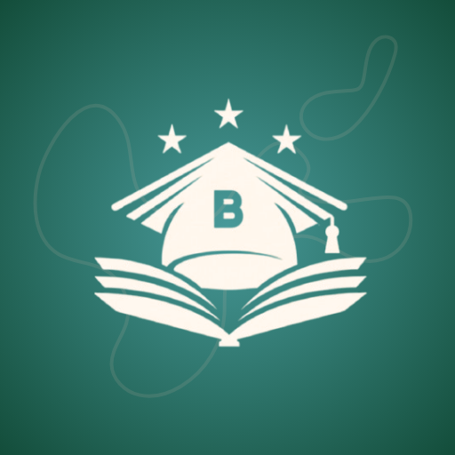
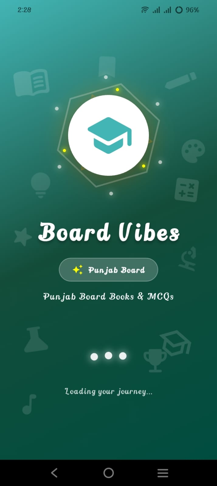
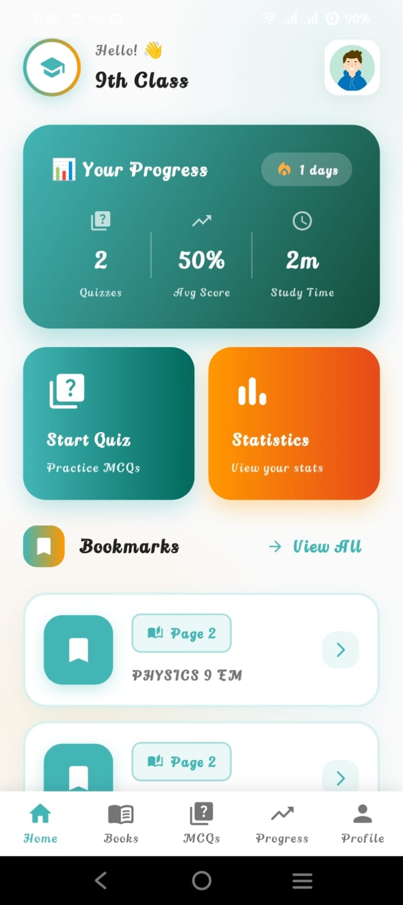
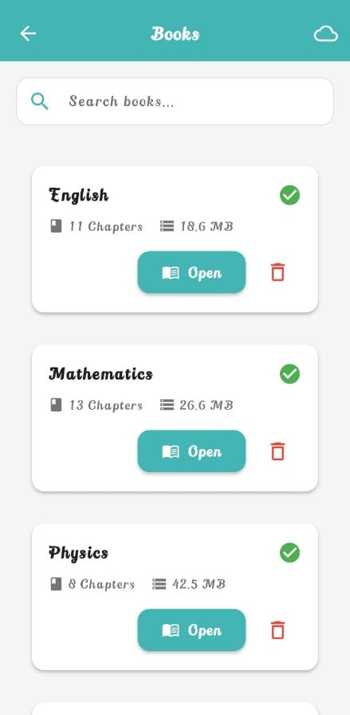
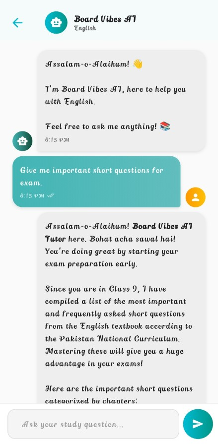
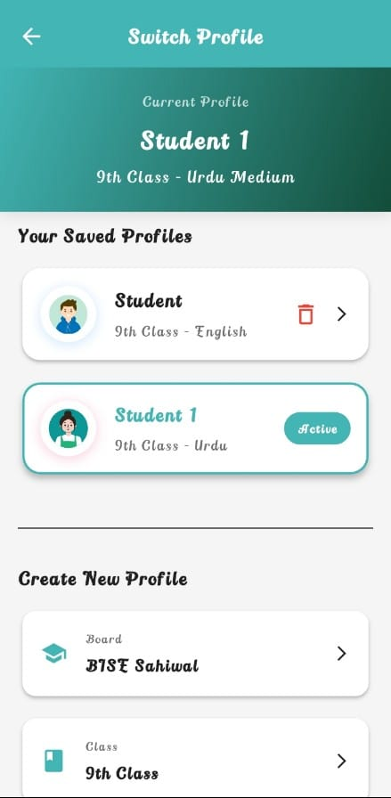
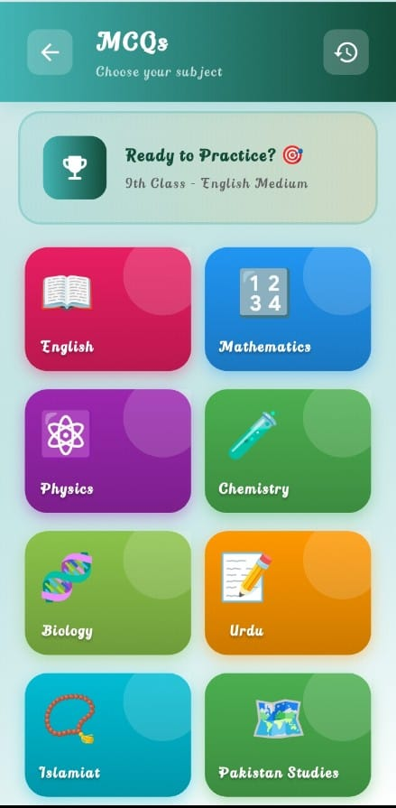
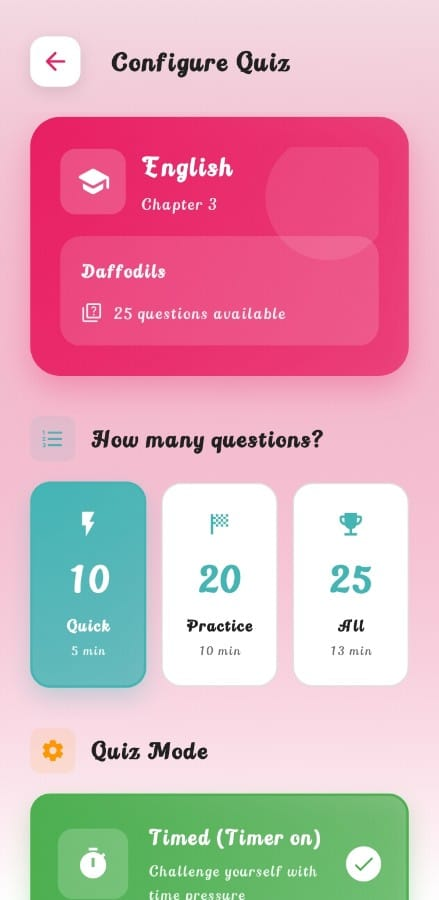
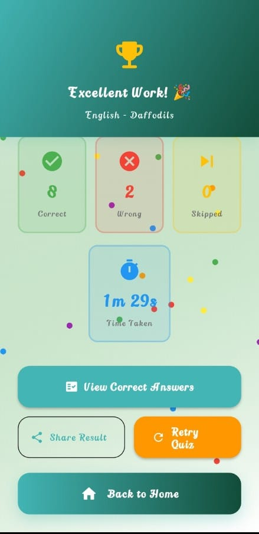
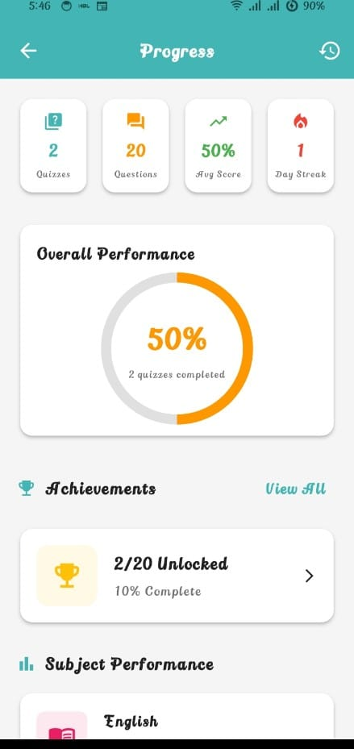

<div align="center">



# Board Vibes
### AI-Assisted Educational Platform for Pakistani Students

[](https://play.google.com/store/apps/details?id=com.areej.board_vibes)


*Built and shipped solo from idea to Play Store.*

</div>

---

## 🎯 The Problem

Pakistani students preparing for board exams face two consistent friction points:

- **Scattered resources** past papers, MCQs, and books live across different apps, WhatsApp groups, and websites
- **Unreliable internet** apps that require connectivity fail exactly when students need them most, especially in rural areas

**Board Vibes** solves both. One app. Offline-first. AI-assisted. Works anywhere.

---

## 📸 Screenshots

<table align="center">
  <tr>
    <td></td>
    <td></td>
    <td></td>
  </tr>
  <tr>
    <td></td>
    <td></td>
     <td></td>
  </tr>
  <tr>
    <td></td>
    <td></td>
    <td></td>
  </tr>
</table>

---

## ✨ Core Features

| Feature | Description |
|---|---|
| 📚 **PDF Books** | Board-specific past papers and books available offline after first download |
| ⚡ **Quiz Mode** | Subject/chapter-wise MCQs with timer, hints, and instant feedback |
| 📊 **Progress Tracking** | Per-subject performance charts, weak area detection, and achievement badges |
| 👥 **Multi-Profile** | Multiple student profiles on a single device with isolated progress |
| 🤖 **Gemini AI Chatbot** | Ask any question, get instant AI-powered explanations without leaving the app |
| 🔔 **Smart Notifications** | Daily study reminders with rotating messages via local notifications |
| 📥 **Content Download** | Students download their board/class content once then it's theirs offline |
| 🏆 **Achievements** | Gamified badges to keep students motivated across their study sessions |
| 💰 **AdMob Monetization** | Banner, Interstitial & Rewarded ads policy-compliant, live revenue |

---

## 🏗️ Architecture

**Pattern:** Feature-first MVVM with Provider  
**Storage strategy:** Local-first (SQLite + SharedPreferences), Firebase for remote sync

```
lib/
│
├── core/                          # App-wide foundation
│   ├── config/
│   │   ├── ad_config.dart         # AdMob unit IDs & config
│   │   └── routes.dart            # Named route definitions
│   ├── constants/
│   │   ├── app_constants.dart
│   │   ├── asset_paths.dart
│   │   ├── colors.dart
│   │   ├── dimensions.dart
│   │   └── strings.dart
│   ├── theme/
│   │   ├── app_theme.dart
│   │   └── text_styles.dart
│   └── utils/
│       ├── animations.dart
│       ├── dialog_helper.dart
│       ├── helpers.dart
│       ├── snackbar_helper.dart
│       └── validators.dart
│
├── data/                          # Data layer
│   ├── local/
│   │   ├── database/
│   │   │   ├── tables/
│   │   │   │   ├── achievements_table.dart
│   │   │   │   ├── bookmarks_table.dart
│   │   │   │   ├── downloads_table.dart
│   │   │   │   ├── progress_table.dart
│   │   │   │   └── quiz_history_table.dart
│   │   │   └── app_database.dart  # SQLite setup & migrations
│   │   └── shared_prefs_helper.dart
│   ├── models/
│   │   ├── board_model.dart
│   │   ├── book_model.dart
│   │   ├── chapter_model.dart
│   │   ├── mcq_model.dart
│   │   ├── quiz_model.dart
│   │   ├── quiz_result_model.dart
│   │   ├── subject_model.dart
│   │   ├── user_preferences_model.dart
│   │   └── user_profile_model.dart
│   └── repositories/
│       ├── board_repository.dart
│       ├── book_repository.dart
│       ├── mcq_repository.dart
│       └── user_repository.dart
│
├── features/                      # Feature modules (self-contained)
│   ├── ai_assistant/
│   │   ├── widgets/
│   │   │   ├── ai_floating_button.dart
│   │   │   ├── chat_bubble.dart
│   │   │   ├── daily_challenge_card.dart
│   │   │   └── quick_action_chips.dart
│   │   ├── ai_chat_screen.dart
│   │   ├── ai_service.dart
│   │   ├── daily_challenge_manager.dart
│   │   └── smart_search_service.dart
│   │
│   ├── books/                     # PDF viewer & book library
│   │
│   ├── home/
│   │   ├── widgets/
│   │   │   ├── animated_stat_card.dart
│   │   │   ├── quick_action_button.dart
│   │   │   ├── recent_activity_card.dart
│   │   │   └── stats_card.dart
│   │   └── home_screen.dart
│   │
│   ├── mcqs/
│   │   ├── widgets/
│   │   │   ├── chapter_card.dart
│   │   │   ├── hint_dialog.dart
│   │   │   ├── option_button.dart
│   │   │   ├── question_card.dart
│   │   │   ├── question_navigator.dart
│   │   │   ├── quiz_timer.dart
│   │   │   ├── result_card.dart
│   │   │   └── subject_card.dart
│   │   ├── chapters_screen.dart
│   │   ├── quiz_config_screen.dart
│   │   ├── quiz_history_screen.dart
│   │   ├── quiz_results_screen.dart
│   │   ├── quiz_screen.dart
│   │   └── subjects_screen.dart
│   │
│   ├── onboarding/
│   │   ├── pages/
│   │   │   ├── books_page.dart
│   │   │   ├── progress_page.dart
│   │   │   └── quiz_page.dart
│   │   └── onboarding_screen.dart
│   │
│   ├── profile/
│   │   ├── about_screen.dart
│   │   ├── edit_profile_screen.dart
│   │   ├── feedback_screen.dart
│   │   ├── profile_screen.dart
│   │   ├── profile_switcher_screen.dart
│   │   └── settings_screen.dart
│   │
│   ├── progress/
│   │   ├── widgets/
│   │   │   ├── achievement_badge.dart
│   │   │   ├── performance_chart.dart
│   │   │   ├── progress_card.dart
│   │   │   ├── progress_chart.dart
│   │   │   ├── stats_summary.dart
│   │   │   ├── subject_performance_card.dart
│   │   │   └── weak_area_card.dart
│   │   ├── achievements_screen.dart
│   │   ├── progress_screen.dart
│   │   ├── quiz_history_detail_screen.dart
│   │   ├── statistics_screen.dart
│   │   └── weak_areas_screen.dart
│   │
│   ├── setup/
│   │   ├── board_selection_screen.dart
│   │   ├── class_selection_screen.dart
│   │   ├── initial_download_screen.dart
│   │   └── medium_selection_screen.dart
│   │
│   └── splash/
│       └── splash_screen.dart
│
├── providers/                     # State management (Provider)
│   ├── achievements_provider.dart
│   ├── book_provider.dart
│   ├── download_provider.dart
│   ├── profile_provider.dart
│   ├── progress_provider.dart
│   ├── settings_provider.dart
│   ├── theme_provider.dart
│   └── user_provider.dart
│
├── services/                      # Business logic layer
│   ├── achievements_service.dart
│   ├── ad_service.dart
│   ├── download_service.dart
│   ├── email_service.dart
│   ├── feedback_service.dart
│   ├── notification_service.dart
│   ├── pdf_service.dart
│   ├── profile_service.dart
│   ├── rating_service.dart
│   ├── statistics_service.dart
│   └── storage_service.dart
│
└── widgets/common/                # Reusable UI components
    ├── animated_button.dart
    ├── animated_counter.dart
    ├── badge_widget.dart
    ├── bottom_nav_bar.dart
    ├── custom_app_bar.dart
    ├── custom_button.dart
    ├── custom_card.dart
    ├── empty_state.dart
    ├── error_state.dart
    ├── gradient_card.dart
    ├── loading_indicator.dart
    ├── loading_shimmer.dart
    ├── rating_dialog.dart
    ├── share_helper.dart
    └── success_animation.dart
```

---

## ⚙️ Key Engineering Decisions

### 1. Offline-First with 5 SQLite Tables
Five dedicated database tables (progress, quiz_history, achievements, bookmarks, downloads) mean the app works fully offline after initial content download. No loading spinners for core features data is always local-first, Firebase syncs in the background.

### 2. Feature-First Folder Structure
Each feature (ai_assistant, mcqs, progress, profile, setup...) is fully self-contained with its own screens, widgets, and logic. Adding a new feature doesn't touch unrelated code the architecture scales cleanly.

### 3. 11 Dedicated Service Classes
`ad_service`, `notification_service`, `download_service`, `statistics_service` and more keep business logic completely out of UI code. Providers consume services; screens consume providers. Clean separation at every layer.

### 4. Board/Class/Medium Setup Flow
Students select their board (BISE Multan, Sahiwal etc.), class (9th/10th), and medium (English/Urdu) once on first launch. All content MCQs, books, AI knowledge base is scoped to their selection. The right data for the right student.

### 5. AdMob Lifecycle Management
`ad_service.dart` handles full ad lifecycle including preloading, disposal on navigate, and `AppLifecycleState` changes to prevent crashes when the app backgrounds mid-ad. Policy-compliant with production `ads.txt`.

### 6. Pagination for Large MCQ Datasets
Quiz datasets contain hundreds of questions per subject. Pagination on list screens prevents loading entire datasets into memory keeps scrolling smooth on low-end devices common in the target market.

---

## 🛠️ Tech Stack

| Layer | Technology |
|---|---|
| UI Framework | Flutter 3.x / Dart |
| State Management | Provider (8 providers) |
| Local Database | SQLite sqflite (5 tables) |
| Remote Backend | Firebase Firestore, Auth, FCM |
| AI Integration | Gemini AI API |
| Notifications | flutter_local_notifications |
| Monetization | Google AdMob (Banner / Interstitial / Rewarded) |
| Architecture | Feature-first MVVM |
| Content | JSON-driven MCQ data (Class 9–10, English & Urdu medium) |

---

## 🚀 Getting Started

```bash
git clone https://github.com/areej01/board-vibes.git
cd board-vibes
flutter pub get
flutter run
```

> Add your own `google-services.json` (Firebase) and AdMob App ID in `AndroidManifest.xml` to run locally.

---

## 📈 Production

- ✅ Live on Google Play Store built and shipped solo
- 💰 Live AdMob revenue (Banner, Interstitial, Rewarded)
- 📱 Optimized for low-end Android devices
- 🌐 Designed for low-connectivity environments (offline-first)
- 🇵🇰 Serving Pakistani Matric students 9th & 10th class, English & Urdu medium

---

## 👩‍💻 Developer

**Areej Fatima** Flutter & Android Developer at Figover EU OÜ

[](https://areejfatima33.github.io/areej-portfolio/)
[](https://www.linkedin.com/in/areej-dev01/)
[](https://play.google.com/store/apps/developer?id=Areexa+Studios)

---

<div align="center">
  <a href="https://play.google.com/store/apps/details?id=com.areej.board_vibes">
    
  </a>
</div>
